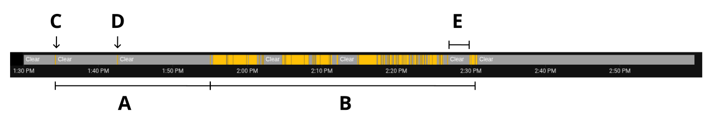

# Home Assistant Vibration Sensor Filter Blueprint

This blueprint filters a vibration sensor's state to robustly track the running status of appliances like a washing machine or dryer.
The running state can then be used for automations to send a notification once the appliance is done.

## Limitations

The filter is optimized to reliably detect that a washing cycle has **stopped**, and prevent those conditions from being triggered more than once during a cycle (false positives).
Detection of both the starting time and stopping time is delayed, in particular the starting time.
In case of my washing machine, I receive a notification 5 minutes after the laundry is done.

## Instructions

Start by mounting a vibration sensor on your appliance and keep it there for a few cycles to gather historical data for tuning.

The blueprint uses three helpers, all of which are explained on the blueprint configuration page, and can be created directly from there.

### Tuning the filter
When configuring the blueprint, you will need to set two tuning variables
- **Started-to-Stopped transition threshold** *duration*.
- **Stopped-to-Started transition threshold** *duration*.

To tune these parameters, open a historic graph of the vibration sensor in Home Assistant and zoom into a cycle.

The actual lenght of the washing program is **A + B**, which lasted just under 1h 30m. However within A, not much happened that triggered vibrations so we cannot reliably detect the program within that phase. The goal is to identify the end of the program robustly and with as little delay as possible, not the start. For this purpose, we will only consider the **B** phase which lasted just over an hour.

#### Tune the Started-to-Stopped transition threshold
This threshold prevents the automation from mistakenly thinking a cycle is over during a temporary pause.

To select a value, identify the longest vibration-free gap within any running cycle. This would be **E** in the figure above, which is just under 3 minutes. The threshold needs to exceed that value, so let's set it to 5 minutes. While you could set it higher, it would increase the delay between the actual end of the program and when you receive a notification.

**Note:** *For this to be robust across multiple washing program, ensure this value is longer than the longest gap in any program.*

#### Tune the Stopped-to-Started transition threshold
This threshold is a safety buffer that prevents the automation from starting a new cycle based on brief, non-cycle-related vibrations, such as events **C** and **D**.

To select a value, follow these steps:

1. **Find your shortest program:** Identify the length of the cycle from the first to the last vibrations (e.g., **B** in the figure). The threshold cannot exceed the length of your shortest program, or the program will not be detected at all.

1. **Add a buffer:** Identify the maximum length of any vibration-triggering conditions that do not mark a cycle (e.g., loading the machine). Add this buffer to your **Started-to-Stopped** transition threshold. In our example, adding a 5-minute buffer to the 5-minute threshold gives us 10 minutes.

1. The final **Stopped-to-Started** transition threshold must be greater than this combined value. A higher value here means a longer delay from the actual start of the program until it's detected. We will set it to 10 minutes to minimize this delay.

### Usage
Once configured, the entity switch can be used to send a notification at the end of a program by creating a separate automation in the Home Assistant UI that triggers on the switch's state change.